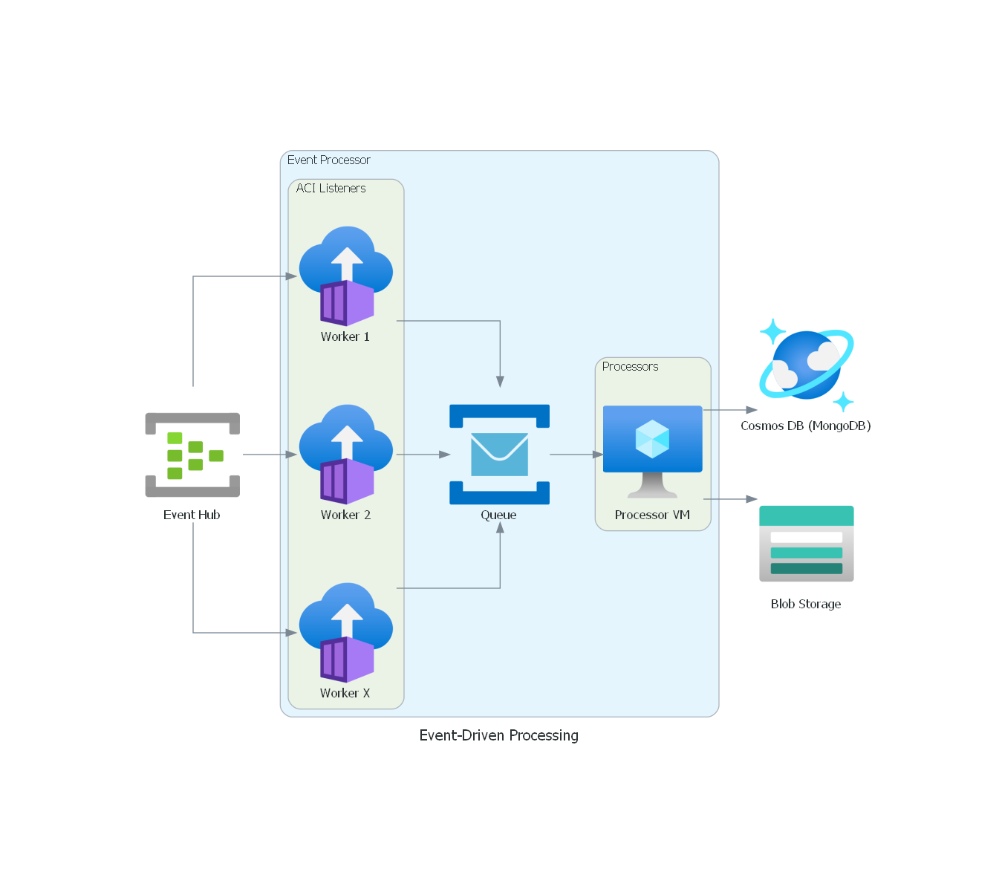

# Event-Driven Processing Architecture using Event Hub, Azure Container Instances, and Cosmos DB

## Pre-requisites

1. Terraform (minimum version 1.1.6)
2. Docker Engine/Docker Desktop 
3. An Azure Subscription (**Contributor** IAM Role or higher recommended)

## Architecture


## Execution
1. Navigate to the [tf-deployment-layers/layer-1](./tf-deployment-layers/layer-1/) folder.
2. Add a file named *"terraform.tfvars"* and declare the variables found in the *variables.tf* file similar to the sample below:
    ```
    subscription_id = "abcdef12345-6789-abcdef" # Your Azure Subscription ID
    solution_prefix = "abcd" # For best results, use a 4-character alphanumeric string
    location        = "eastus" # The Azure region in which you will deploy the solution
    ```
3. Staying in [tf-deployment-layers/layer-1](./tf-deployment-layers/layer-1/), initialize the working directory with `terraform init`

4. Once initialization has completed, run `terraform plan` to view and assess the resources that will be created.

5. If you are satisfied with the planned changes, run `terraform apply` and enter *"Yes"* when prompted to provision the Azure resources.

6. Once complete, the first layer of Azure resources should be provisioned, including:
    - Resource Group
    - Bastion to connect to remote private instances
    - Container Registry
    - Log Analytics Workspace
    - Key Vault
    - Storage Account for utility functions
    - Virtual Network with subnets and NSGs
    - Event Hub with Private Link and Endpoint
    - Cosmos DB with Private Link and Endpoint

7. Navigate to [python-scripts](./python-scripts/) and update the *send.py* and *receive.py* scripts with the required values.
    - `AZURE_EVENTHUB_CONNECTION_STRING`
    - `AZURE_EVENTHUB_NAME`
    - `AZURE_STORAGE_CONNECTION_STRING`

    You may opt to test them in an Azure Virtual Machine connected to the private network (the Event Hub may only be accessed from within the vnet). After this, build the Docker images (*receive.py* is necessary; *send.py* is optional) with the following commands:
    ```
    # /python-scripts/receive/
    docker build -t receivepy . # Build the Docker image
    docker image tag receivepy:latest ACR_NAME.azurecr.io/receivepy:latest # Label the Docker image for publishing
    az acr login -n ACR_NAME # Authenticate into the Azure Container Registry
    docker push ACR_NAME.azurecr.io/receivepy:latest # Push the Docker image to the Azure Container Registry
    ```

**TO-DO - THE FOLLOWING SECTION HAS NOT YET BEEN IMPLEMENTED**

8. At this point, the first layer of Azure resources and the container that listens to the Event Hub have been deployed. Navigate to [tf-deployment-layers/layer-2](./tf-deployment-layers/layer-2/) to deploy the Azure Container Instances.

## Further help
If you encountered issues or would like to suggest improvements to these samples, create an issue [here](https://github.com/miguelarcilla/az-tf-starterpacks/issues).